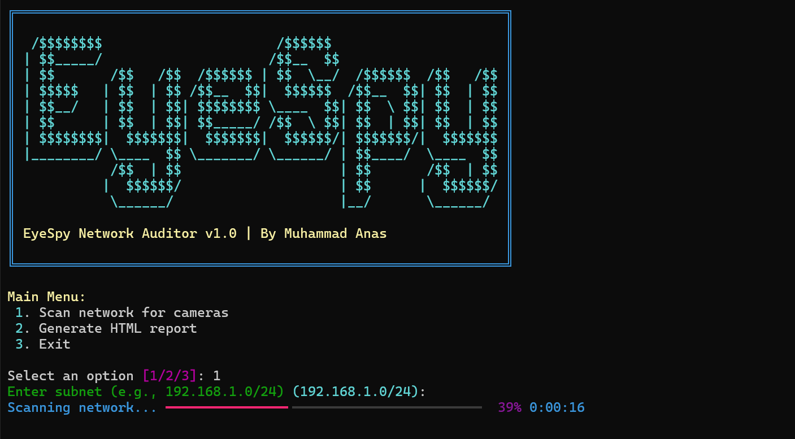

# EyeSpy Network Auditor 🕵️‍♂️



**EyeSpy Network Auditor v1.0** — a Python-based network scanning tool designed to detect nearby IP and ONVIF cameras, extract their details, and generate an organized HTML report. It’s created to help IT teams and cybersecurity professionals quickly audit camera networks within internal or external subnets.

---

## 🚀 Features
- **Network Camera Scanner:** Detects IP and ONVIF-compatible cameras in your LAN or specified subnet.
- **ONVIF Device Info:** Retrieves manufacturer, model, and other details automatically using the `onvif_zeep` library.
- **HTML Report Generator:** Creates a clean, clickable report with links to each device’s web UI.
- **Menu-Based CLI:** Simple text-based interface with colored menus and progress bars.
- **Public Exposure Check:** (Optional) Uses `miniupnpc` to check if any camera is accessible from the public internet.
- **Fast & Lightweight:** Works cross-platform on Windows, Linux, and macOS.

---

## ⚙️ Installation

### Prerequisites
Make sure you have Python 3.8+ installed.

### Clone the Repository
```bash
git clone https://github.com/techcorp/EyeSpy.git
cd EyeSpy
```

### Install Required Packages
```bash
pip install -r requirements.txt
```
If you face issues installing `miniupnpc`, you can skip it using:
```bash
pip install rich tqdm requests onvif_zeep wsdiscovery jinja2
```

---

## 🧭 Usage
Run the tool from the terminal:
```bash
python eyespy.py
```

You’ll see a colorful banner and a simple menu:

```
Main Menu:
1. Scan network for cameras
2. Generate HTML report
3. Exit
```

### Example Workflow
1. Choose **option 1** → Enter subnet (e.g. `192.168.1.0/24`)
2. Scanning starts and detects connected devices
3. Choose **option 2** to export results into an HTML report with clickable camera links

The generated report will be saved in the current directory as `report.html`.

---

## 📦 Folder Structure
```
eyespy-network-auditor/
│
├── eyespy.py               # Main script
├── requirements.txt        # Dependencies
├── report_template.html    # Jinja2 HTML template
├── README.md               # Documentation
└── outputs/                # Generated reports
```

---

## 🧰 Dependencies
- `rich` — Colorful terminal output
- `tqdm` — Progress bars
- `onvif_zeep` — ONVIF camera details
- `requests` — HTTP device checking
- `wsdiscovery` — Network device discovery
- `jinja2` — HTML report generation
- `miniupnpc` *(optional)* — Public exposure check

---

## 🧑‍💻 Author
**Muhammad Anas**  
IT Support Associate | Cybersecurity Expert | Ethical Hacker  
📧 Contact: [Linkedin](https://www.linkedin.com/in/mohammad-anas786/)

---

## 🛡️ Disclaimer
This tool is for authorized **internal security auditing** only. Ensure you have proper permissions before scanning any network.

---

**© 2025 TechCorp — EyeSpy Network Auditor v1.0**

